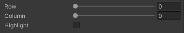
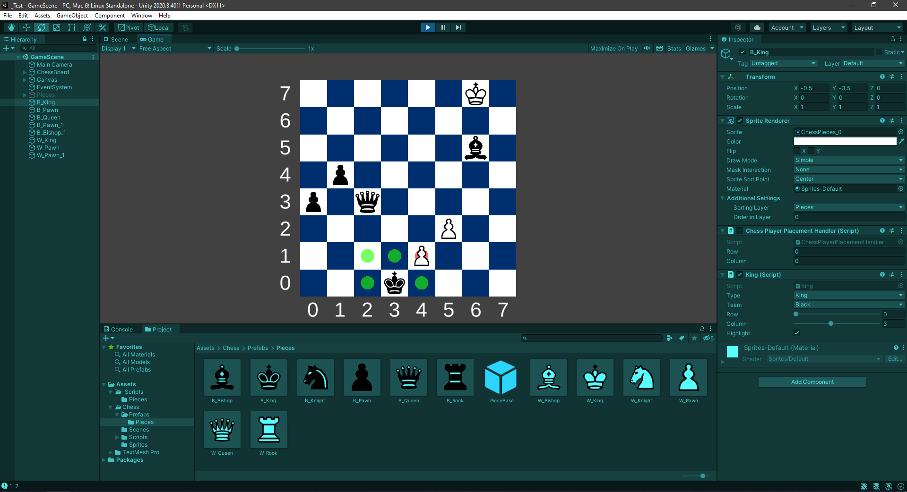

# Chess Piece Highlight Documentation

## Overview

- This Readme will showcase or guide you through a component derived from class ChessPiece explaining basic setup to test the functionality.
- In this document we mentioned about the component as well as the attached some working examples for all the pieces.

## Demo

- Before going into play mode provide *Row* and *Column* in the **ChessPiece** Component so that it can be registered by the Chess Board
- Also set the highlight to true for the piece you want to highlight.

**Note** : In case you are unable to see Images in this `Readme`. You can Find the Images in this Folder - "Assets/Demo/"

### Extra Changes 

- In class `ChessBoardPlacementHandler.cs`
  - Added field for highlight for Takedown pieces.
  - Additional changes were made for selection of highlights based on `bool` parameter `isNormal`.

--- 

## About the component
**ChessPiece Component** - 

#### Description
Abstract class representing a generic chess piece. It includes methods and properties common to all chess pieces.

#### Properties

- `type`: Type of the chess piece (`PieceType`).
- `team`: Team (color) of the chess piece (`PieceTeam`).
- `row`, `column`: Current position of the chess piece on the chess board.
- `directions`: Array of directions in which the piece can move.
- `doIterativeCheck`: Flag to toggle between single-step and multi-step move checks.
- `highlight`: Debug flag to indicate if the piece should be highlighted.

##### Enums

-  `PieceType`
    Enumeration for different types of chess pieces:
    - `none`: Represents no specific piece type.
    - `pawn`, `rook`, `knight`, `bishop`, `queen`, `king`: Represents standard chess piece types.
-  `PieceTeam`
    Enumeration for different teams (colors) of chess pieces:
    - `none`: Represents no specific team.
    - `white`, `black`: Represents white and black chess piece teams, respectively.

#### Methods

- `Initialize()`: Virtual method to initialize the chess piece.
- `OnSelect()`: Virtual method to handle the selection of the chess piece.

#### Public Methods

- `GetPieceType()`: Returns the type of the chess piece.
- `GetPieceTeam()`: Returns the team (color) of the chess piece.
- `GetPossibleMoves(ChessPiece[,] board)`: Virtual method to calculate and return possible moves for the chess piece based on its current position and the state of the chess board.

#### Inherits

Class Chess Piece is inherited into six child class representing each piece contains in the chess.
1. Pawn
2. Rook
3. Knight
4. Bishop
5. King
6. Queen

---

## Tests Example

### Pawn Example

### Rook Example

### Knight Example

### Bishop Example

### Queen Example

### King Example

